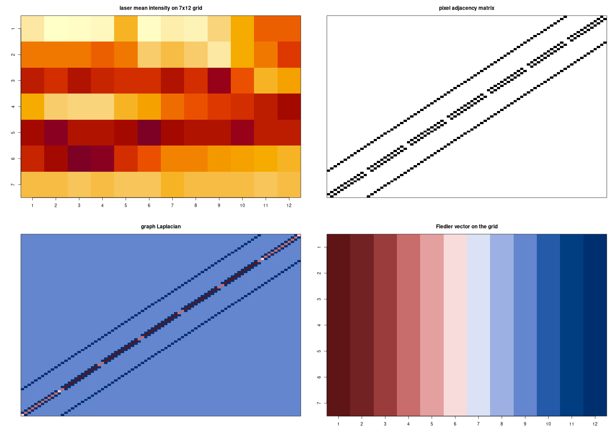

# hyperSpec Graph Laplacian Demo

This example uses the `hyperSpec` R package and the bundled `laser` dataset to:

- load hyperspectral pixel data
- build a simple 4-neighbor pixel adjacency matrix on a 2D grid
- compute the graph Laplacian with base R
- save a plot to `hyperSpec_laplacian_plot.png`

## Files

- `graph_laplacian_demo.R`: main R script
- `hyperSpec_laplacian_plot.png`: generated output image

## Prerequisites

You need:

- `R`
- internet access the first time the script runs, so `hyperSpec` can be installed from CRAN if it is not already installed

## Install R on Arch Linux

```bash
sudo pacman -Sy --needed r
```

Check that R is available:

```bash
R --version
Rscript --version
```

## Run the script

From the project directory:

```bash
Rscript graph_laplacian_demo.R
```

## What the script does

The script:

1. installs `hyperSpec` if needed
2. loads the `laser` dataset
3. arranges pixels on a `7 x 12` grid
4. builds a 4-neighbor adjacency matrix
5. computes the graph Laplacian `L = D - A`
6. computes the Fiedler vector from the Laplacian eigen-decomposition
7. saves a 4-panel plot as `hyperSpec_laplacian_plot.png`

## Output

The script generates the following image:



## Verify the output

Check that the image file was created:

```bash
ls -lh hyperSpec_laplacian_plot.png
```

Open the image on Linux:

```bash
xdg-open hyperSpec_laplacian_plot.png
```
