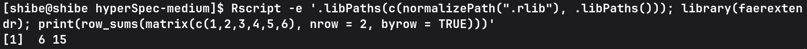

# faerextendr

Minimal R package showing how to pass a dense matrix from R to Rust with `extendr`, compute row sums using `faer`, and return the result to R.

## Requirements

- R
- Rust toolchain with `cargo`

## Install

From the package root:

```bash
mkdir -p .rlib
R CMD INSTALL . -l ./.rlib
```

## Usage

```bash
Rscript -e '.libPaths(c(normalizePath(".rlib"), .libPaths())); library(faerextendr); print(row_sums(matrix(c(1,2,3,4,5,6), nrow = 2, byrow = TRUE)))'
```

Expected output:



```r
[1]  6 15
```

## Run Tests

```bash
Rscript -e '.libPaths(c(normalizePath(".rlib"), .libPaths())); library(faerextendr); library(testthat); test_file("tests/testthat/test-row-sums.R", reporter = SummaryReporter$new())'
```
